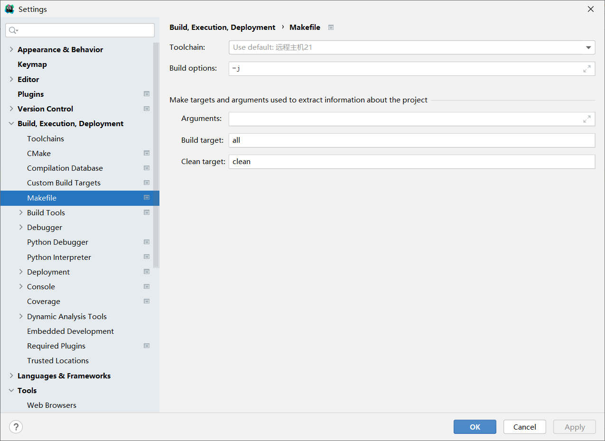
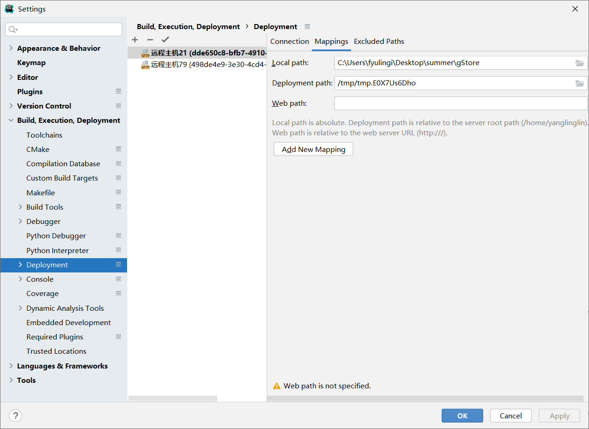
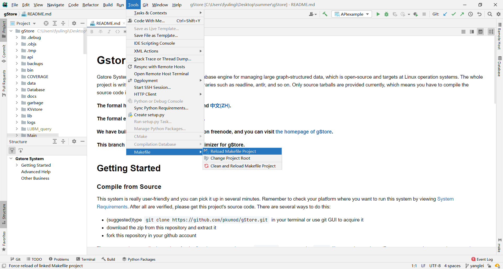
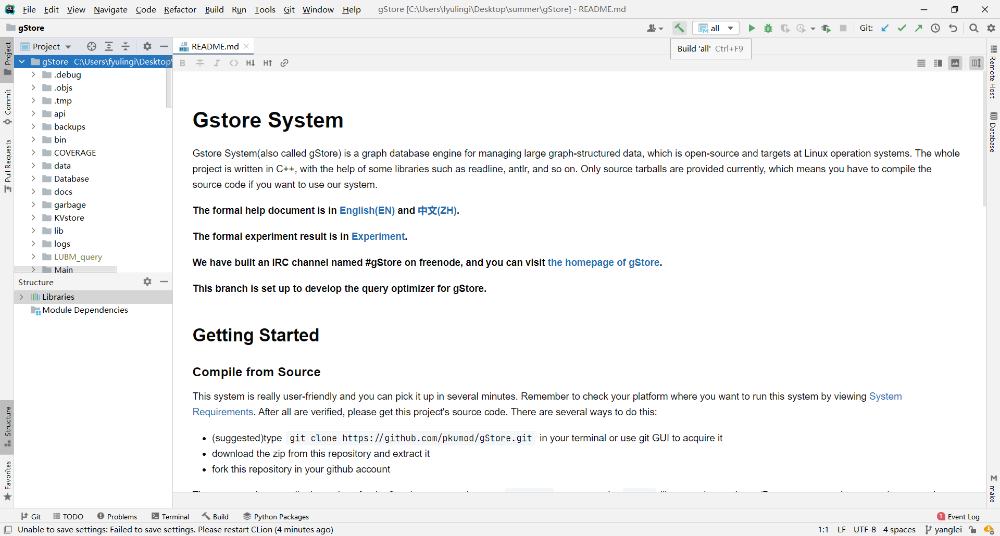
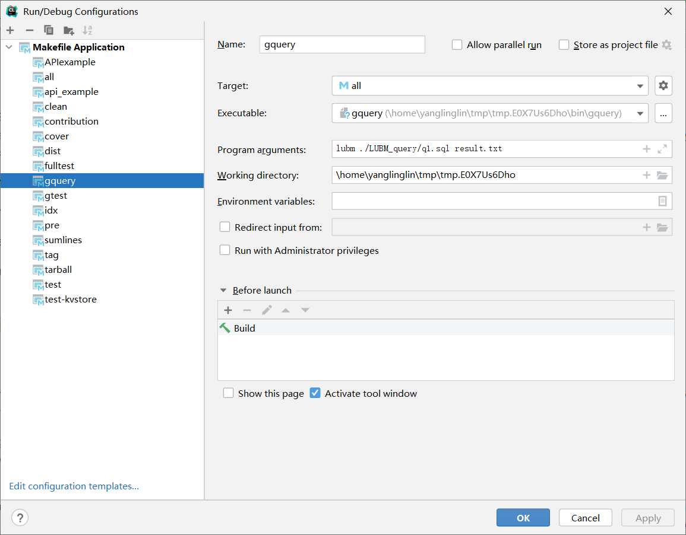

# How to use CLion to work on gStore

## Write on Top

Why am I writing this? Because I have spend much time on gStore, and we all know that gStore is running on linux system, which is difficult for us to build, debug with it. So I write this blog to teach more people how to work remotely with CLion. The method not only work well with gStore, but other remote makefile projects.

## SSH Configure

First, you need add one SSH remote configure to your CLion, this is necessary if you want to open a SSH terminal window or build(run, debug) you project remotely.

All you need to do is click `File`-`Settings`-`Tools`-`SSH Configurations`，than add your own SSH information on it. You can `Test Connection` to check whether your configuration is right.

## Toolchains and Makefile configure

In `File`-`Settings`-`Build, Execution, Deployment`, there are several configurations need us to make.

First, in `Toolchains`, click `+` to add one new Remote Host Toolchains and move it to the top to be default. Once you choose the credentials, the Clion will help you detect other settings automatic.

Then you need to configure `Makefile`, you can add personalized parameter on it. For example, I'd like to add `-j` to speed up the build.

## Deployment configure

Still in `File`-`Settings`-`Build, Execution, Deployment`,  but with `Deployment`. You can click `Autodectect` to detect you home root path.

You can also assign your project deployment path.

## Load your project

Once you have done configurations above, you only need to click `Tools`-`Makefile`-`Reload Make Project`, this will upload your codes to remote host and analysis the `makefile` automatically.

## Build

You will find several `Makefile Application` on the navigation bar. For example, you can click the hammer to build the project. Notice: the action will generate executable file on your remote host.

## Run and Debug

You can also add configuration to run your program or debug. You just have to add executable file path. Then everything is done. Enjoy your journey with the "BEST" graph database manage system gStore!

