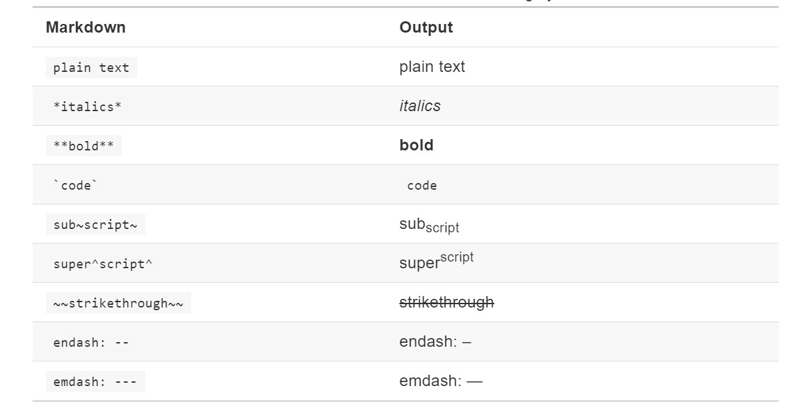

# Some R Markdown Tips

This text tells you some useful **R Markdown** tips to make your document more beautiful

* `\newpage` to begin a new page
* `&nbsp;` to begin a new line
* `` to insert a picture
* `{r setup, warning=FALSE}` to remove warning message
* `{r,results="hide"}` to hide your console results
* When use unordered sub-lists, it may be OK if you convert your `.Rmd` to `.html`, but the second sub-lists symbol may be `-`. To make it a hollow bullet, you just need to add `\renewcommand{\labelitemii}{$\circ$}` to your `header.tex` 
* To knit your Rmd document to pdf with Chinese character in it, your can try this Rmd head document

  ```
    ---
    title: "title"
    documentclass: ctexart
    author: Yuling
    geometry: "left=3cm"
    output:
      rticles::ctex:
        fig_caption: yes
        number_sections: no
        toc: yes
        includes:
          in_header: header.tex
          classoption: "hyperref,"
    ---
    ```{r include=FALSE}
      #其他设置
    knitr::opts_chunk$set(out.width = "65%", fig.align = "center", warning = FALSE, message = FALSE, results = "hold")
    ` `` # remove the space when copy this codes to your own Rmd document

    ```{r setup-pdf, include=FALSE}
    pdf.options(family="GB1") #使图片中可以显示中文
    ` ``# remove the space when copy this codes to your own Rmd document
  ```
  Remember to move your "head.tex" to your current directory.
 <div align="center"></div>
