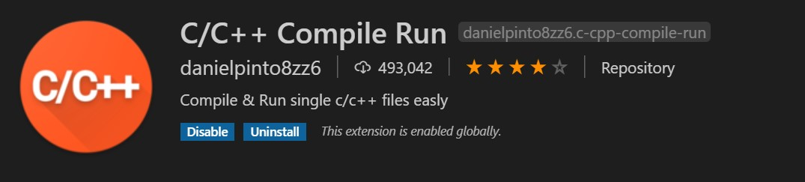

# VS Code + C/C++ Compile Run

This text helps you code C or C++ documents with VS Code without much troublesome ".json" settings.

To build C environment within your VS Code, you just need to find **C/C++ Compile Run** extension: 

Then install it.

Congratulations! Now you can comlile and run your C/C++ files just as the names of the extension shows with only press `f6`. So easy, right?
